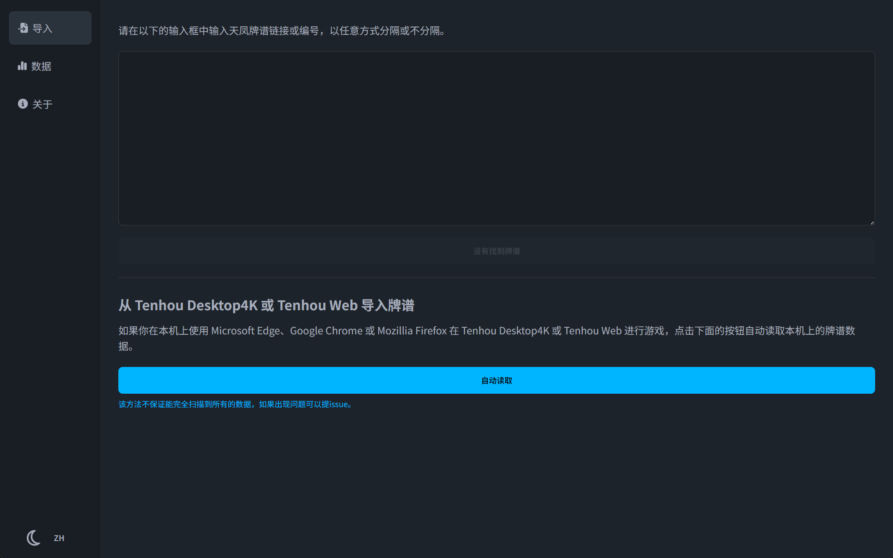
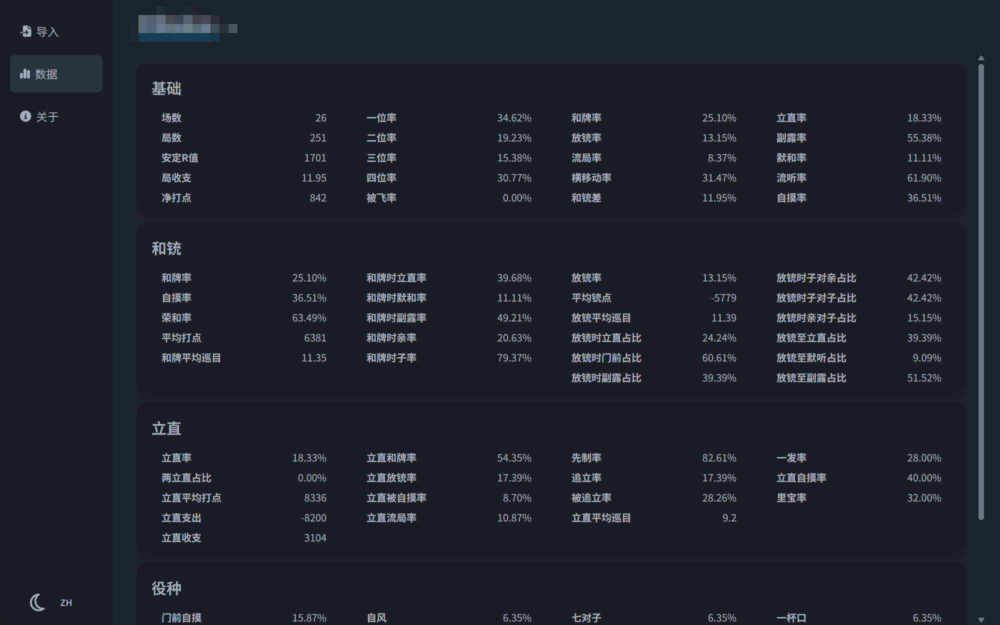

# Tenhou Paifu Analyzer

## Description

This is a simple tool to record and analyze Tenhou mahjong games. It can analyse the game logs and provide some statistics about your performance.

Locale support:
* 简体中文
* English (Translated by ChatGPT)
* 日本語 (Translated by ChatGPT)

## Screenshots

## Contribute

If you want to contribute to this project, please fork this repository and submit a pull request.

Localization corrections are welcome.

Feature requests can be submitted in the issues section.

## License

This project is licensed under the MIT License - see the [LICENSE](LICENSE) file for details.